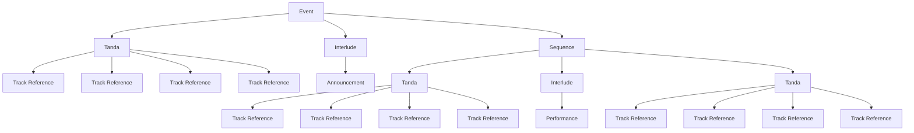

# Performance Model

## Purpose

The Performance Model describes how MusicStewardship represents the **structure of a
musical event as a program**, rather than merely as a collection of tracks.

Its purpose is to provide a stable conceptual model between:

- the underlying music collection and its recordings;
- curated musical elements such as tandas;
- non-musical or mixed interludes;
- larger ordered sequences; and
- the complete event experienced by dancers and the DJ.

The model is deliberately broader than the playback representation required by
TangoDJ. MusicStewardship is the place where the meaning, relationships,
provenance, decisions, observations, and later performance knowledge can be
retained. TangoDJ is a downstream operational representation.

---

## The Performance Tree

An event can be represented as a tree of nested program elements:



This diagram is conceptual. It illustrates the relationships and nesting of
the design-level elements; it is not a database schema.

### Element hierarchy

At the design level, the important distinction is between the **musical artifact**,
the **social-dance unit**, and the **larger musical/programmatic trajectory**:

```text
Track
└── one recording

Tanda
└── ordered Track References
    └── tango-specific social-dance unit,
        normally danced with one partner

Interlude
├── musical
│   ├── Cortina
│   ├── Room / pre-event music
│   └── Performance music
├── non-musical
│   ├── Announcement
│   └── Presentation / demonstration
└── mixed

Arc
├── Tanda
├── Interlude
├── Arc
│   ├── Tanda
│   ├── Interlude
│   └── Tanda
└── ...

Event
└── complete tree of Arcs, Tandas, Interludes,
    and their referenced recordings
```

An **Arc is recursive**. It may be a simple sequence of elements, or it may
contain nested Arcs, Tandas, and Interludes. An Arc may therefore describe a
small musical progression or a substantial portion of an event.

An Event is ultimately defined by its complete performance tree.

The earlier concept of a Sequence should not be confused with an Arc. **Order**
is a structural property of any container. An **Arc** additionally expresses a
meaningful musical or programmatic trajectory through that order.

---

## Design-Level Elements

The following are **design-level concepts**, not yet implementation-specific
database tables, file formats, or APIs.

### Event

The complete program of a particular musical event.

An Event provides the root of the performance tree and establishes the order in
which its elements occur.

### Tanda

A Tanda is **not simply a playlist or collection of tracks**. In this model it
is a **tango-specific social-dance unit**: an ordered group of recordings
intended to be danced as one unit, normally by one dancer with the same partner.

The familiar tango structure (for example, T-T-V-T or T-T-M-T) is a property of
the Tanda and its musical rules, not of the individual recording.

The order matters because the dancers experience the tracks as one musical and
social progression.

Other dance traditions may have their own analogous groupings, but those are
outside the intended scope of this model. The general Event/Arc/Interlude
architecture may eventually accommodate them, but MusicStewardship's current
domain model is specifically concerned with Argentine tango.

A recording is referenced rather than copied.

### Interlude

An Interlude is a **program-role element**, not a media-type classification.
It alters, punctuates, separates, precedes, follows, or otherwise modifies the
flow of the principal dance program.

An Interlude may be:

- **musical** — for example a cortina, room/pre-event music, transition music,
  or performance music;
- **non-musical** — for example an announcement, presentation, or demonstration;
- **mixed** — for example an announcement accompanied by music.

The most characteristic tango Interlude is the **cortina**. A cortina commonly
separates Tandas, but an Interlude is not defined solely by being between Tandas.
For example, music filling the room before the first Tanda is also an Interlude.

The distinction between an Interlude and a Tanda is therefore semantic:

- a **Tanda** is a social-dance unit intended to be danced as one unit, normally
  by one dancer with the same partner;
- an **Interlude** serves another program function.

This definition deliberately allows additional Interlude subtypes to emerge
without changing the underlying model.

### Arc

An Arc is a larger musical or programmatic trajectory.

An Arc may contain:

- Tandas;
- Interludes;
- other nested Arcs; and
- ordered combinations of these elements.

Arcs are therefore recursive. A small Arc may describe a short progression of
Tandas; a larger Arc may contain several smaller Arcs and encompass a substantial
portion of an event.

An Arc is more than an ordered sequence: it provides a conceptual unit for the
progression or trajectory of the musical/programmatic experience.

Ultimately, the complete Event is defined by its tree of Arcs, Tandas,
Interludes, and their referenced recordings.

### Sequence

Sequence is a structural notion of ordered elements, not a synonym for Arc.

An ordered sequence may occur within an Arc or elsewhere in the model. An Arc
adds the concept of a meaningful musical or programmatic trajectory to that
ordering.

### Track Reference

A reference from a curated element to a canonical recording.

The Track Reference is deliberately not another copy of the recording metadata.
The canonical recording remains in the music collection.

---

## Reuse and Identity

The model separates **definition** from **use**.

A particular recording may appear in:

- multiple Tandas;
- multiple Sequences;
- multiple Events.

Likewise, a curated Tanda may be reused in more than one event.

The event tree therefore represents **what was placed where**, while the
underlying recording and curated-element repositories retain the identities and
descriptions of the things being used.

This distinction will become important when event-specific observations are
added later.

---

## Why a Tree?

The tree is a natural representation of a DJ event because an event is not
simply a flat list of songs.

The recursive nature of Arcs is especially important. A DJ can think about an
event at several scales: an individual Tanda, a short progression of Tandas, a
larger arc of the evening, or the complete event. The same structural model can
represent all of those scales without flattening the relationships.

For example:

```text
Event
│
├── Arc: Opening
│   ├── Interlude: Room music
│   ├── Tanda
│   └── Interlude: Cortina
│
├── Arc: Main Program
│   ├── Tanda
│   ├── Interlude: Announcement
│   ├── Arc: Sub-arc
│   │   ├── Tanda
│   │   ├── Interlude: Cortina
│   │   └── Tanda
│   └── Tanda
│
└── Arc: Closing
    └── Tanda
```

The structure captures both:

1. **order** — what happens next; and
2. **composition** — what a larger program element consists of.

That makes it possible to reason about an event at several levels without
destroying the underlying detail.

---

## Relationship to TangoDJ

The Performance Model is **not intended to reproduce TangoDJ's internal
organization**.

Instead:

```text
MusicStewardship
    │
    │  curated program structure
    ▼
Performance Model
    │
    │  translation / export
    ▼
TangoDJ
    │
    ▼
Playback
```

MusicStewardship remains the canonical source for the meaning and structure of
the program. TangoDJ receives the subset and representation necessary to
perform it.

This permits the MusicStewardship model to grow beyond the capabilities or
terminology of any particular playback application.

---

## Design-Level Specification vs. Implementation

The Performance Model documents the **design vocabulary and relationships**.

The implementation may later introduce:

- Python classes;
- JSON representations;
- database tables;
- identifiers and foreign keys;
- validation rules;
- import/export formats;
- TangoDJ translation mechanisms.

Those are implementation concerns and should not be confused with the
design-level model.

The design should remain understandable even if the implementation technology
changes.

---

## Current Design Principles

> **A Track is a recording; a Tanda is a tango-specific social-dance unit; an
> Interlude is a program-role element that may be musical, non-musical, or
> mixed; an Arc is a
> recursive musical/programmatic trajectory; and an Event is the complete tree
> that ultimately defines the performance.**

> **Musical recordings are referenced by program elements rather than
> duplicated within them.**

The model describes the structure and meaning of a lived musical event without
prematurely limiting the design to a flat playlist or to the implementation
terminology of any particular playback application.
